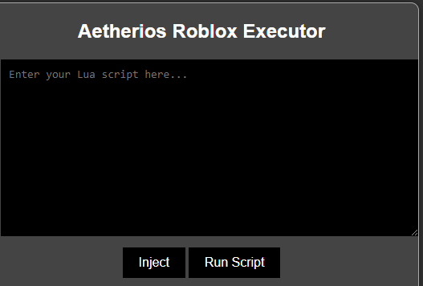

## !!READ ME!! ##
if your executor doesn't work, try these things before you report an issue:

1. Is your firewall on?
2. Did you run as ADMIN
3. Is your antivirus blocking
4. Make sure the executor and DLL are in the same folder

# Aetherios Roblox Executor (Level 7)

Aetherios is a powerful Roblox executor designed to provide advanced scripting capabilities for manipulating Roblox games. It is classified as a Level 7 executor, offering extensive control over game environments beyond standard gameplay.

## Features

- **Script Execution**: Execute custom Lua scripts within Roblox games.
- **Game Manipulation**: Modify game elements, assets, and behaviors.
- **Enhanced Control**: Bypass Roblox security measures to access restricted features.
- **User-Friendly Interface**: Intuitive UI for easy navigation and script execution.

## Installation

1. **Download**: Obtain the Aetherios Executor setup executable file (`Aetherios-Setup.exe`).

2. **Setup**: Double-click `Aetherios-Setup.exe` to install the executor on your Windows system.

## Usage

1. **Launch**: Open the installed application (`Aetherios.exe`).
2. **Login**: Enter your Roblox account credentials (recommended for testing purposes only).
3. **Execute Scripts**: Use the UI to load and execute Lua scripts in Roblox games.

## Security Note

- **Caution**: Using Aetherios Executor or any other third-party executor violates Roblox's terms of service and can lead to account suspension or banning.
- **Educational Use Only**: Aetherios is intended for educational purposes and learning about game development. Do not use it for malicious activities.

## Development Status

Aetherios Roblox Executor is currently in development. It may have bugs or incomplete features. Use it at your own risk and contribute to its improvement by reporting issues and suggesting enhancements.

## Screenshot Of GUI

## Contributing

Contributions to Aetherios Executor are welcome. Please fork the repository and submit pull requests for any enhancements or bug fixes.

## License

This project is licensed under the MIT License. See the [LICENSE](LICENSE) file for details.
